# AI 工具協助差異化教學

---

> **研習對象**：高中教師（數位前導計畫學校）
> **核心理念**：以**自我決定理論（SDT）**的三大心理需求——**勝任感、自主性、關係**——為架構，搭配 AI 工具，實現可落地的差異化教學
> **你會帶走**：3 個可長久使用的 AI 教學工具 + 動機理論的教學設計思維

---

## 研習配套檔案一覽

> 以下是你拿到的所有檔案，先認識一下它們在哪。

```
📁 output/
│
├── 📁 教材/
│   └── 📄 研習教材_AI工具協助差異化教學.md  ← 你正在看的這份
│
├── 📁 GAS程式碼/                          ← 三個工具的程式碼在這裡！
│   ├── 📄 README.md                       （安裝說明總整理）
│   ├── 📄 工具1_段考AI審題助手.js           （複製貼上到 Apps Script）
│   ├── 📄 工具2_動態評量產生器.js           （複製貼上到 Apps Script）
│   └── 📄 工具3_AI學生回饋系統.js           （複製貼上到 Apps Script）
│
└── 📁 指引/
    └── 📄 NotebookLM設定指引.md            （工具③ 搭配使用的指引）
```

**程式碼怎麼用？** 打開對應的 `.js` 檔案 → 全選複製 → 貼進 Google Apps Script → 就可以用了！
每個 `.js` 檔案最上面都有完整的安裝步驟說明。

---

## 目次

| Part | 主題 | 對應需求 |
|:---:|------|:---:|
| 1 | 動機理論基礎 + 段考 AI 審題助手 | 勝任感 |
| 2 | 教材差異化：AI 改廠商簡報 | 勝任感 |
| 3 | 動態評量產生器 | 勝任感（補強） |
| 4 | 多元評量 Rubric + AI 學生回饋系統 | 自主性 + 關係 |
| 5 | 分享與總結 | — |

---

# 第一節：動機理論 + 段考 AI 審題助手

## 1.1 動機理論基礎

### 為什麼要談動機？

差異化教學不只是「出不同難度的題目」，更重要的是：**讓每一位學生都願意學**。而動機理論告訴我們，學生願意學的關鍵在於三件事。

### 自我決定理論（Self-Determination Theory, SDT）

由心理學家 Deci 與 Ryan 提出，人的內在動機來自三大心理需求：

```
┌─────────────────────────────────────────────────┐
│              自我決定理論 SDT                      │
│                                                   │
│   ┌───────────┐  ┌───────────┐  ┌───────────┐    │
│   │  勝任感    │  │  自主性    │  │   關係     │    │
│   │Competence │  │ Autonomy  │  │Relatedness│    │
│   │           │  │           │  │           │    │
│   │ 我做得到！ │  │ 我可以選！ │  │ 有人在乎！ │    │
│   └───────────┘  └───────────┘  └───────────┘    │
│                                                   │
│   → 段考審題     → 多元評量     → AI 回饋系統      │
│   → 教材差異化   → 選擇策略     → 個人化互動       │
│   → 動態評量                                      │
└─────────────────────────────────────────────────┘
```

### 內部動機 vs. 外部動機：畫畫實驗

經典實驗：將幼兒分成兩組畫畫——

| | A 組（無獎勵） | B 組（畫完給糖果） |
|---|---|---|
| 實驗中 | 自由畫畫 | 知道畫完有糖果 |
| 隔天再測 | **繼續畫**（動機不變） | **不想畫了**（動機下降） |
| 原因 | 畫畫本身就是目的 | 目的變成「得到糖果」 |

> **結論：外部獎勵會削弱內部動機。** 這就是為什麼「加分」不是萬靈丹。

### 動機的四個象限

```
         正向          負向
      ┌──────────┬──────────┐
 內部 │ 我想做！   │ 我不做    │  ← 最持久
      │（喜歡畫畫）│ 會不安    │
      ├──────────┼──────────┤
 外部 │ 做了有獎勵 │ 不做會    │  ← 最短暫
      │（加分、糖果）│ 被處罰    │
      └──────────┴──────────┘

      動機強度：內部正向 ＞ 內部負向 ＞ 外部正向 ＞ 外部負向
```

### 選擇增加動機：滷肉飯 + 炸豆腐策略

> 一家店只賣滷肉飯，評分 4.0。
> 加上一道不太好吃的炸豆腐後，客人可以「選擇」→ 選了滷肉飯 → 滿意度反而提高！

**教學應用：**

- 原本只有一種作業形式（寫兩頁報告）
- 加上一個「更難」的選項（寫報告 + 錄 2 分鐘口頭說明）
- 學生「選擇」只寫報告 → 覺得輕鬆 → 動機提升

> 你不需要真的降低難度，只需要讓學生覺得「這是我自己選的」。

### 三大需求 × 差異化教學 × AI 工具對照表

| 心理需求 | 差異化策略 | AI 工具 | 學生感受 |
|---------|----------|--------|---------|
| **勝任感** | 題目難度分層、雙向細目表檢核 | 段考 AI 審題助手 | 「我準備的有出到！」 |
| **勝任感** | 教材難度調整、在地化情境 | AI 改廠商簡報 | 「老師講的我聽得懂！」 |
| **勝任感** | 動態提示、邊做邊學 | 動態評量產生器 | 「我也可以得分！」 |
| **自主性** | 多元評量形式（文字/圖像/Podcast） | Gemini 產 Rubric | 「我可以用擅長的方式！」 |
| **關係** | 個人化回饋、AI 逐項評語 | AI 學生回饋系統 | 「老師有認真看我的作品！」 |

---

## 1.2 工具 ①：段考 AI 審題助手

### 問題情境

> 「老師，我念的都沒出！」
> 「這次段考好難，前面都沒有基本題。」
> 「為什麼 8-4 一直重複考，8-1、8-2、8-3 都沒有？」

**老師的困境：**
- 出題時間壓力大，容易偏重某些單元
- 難度分布不均：要嘛太簡單，要嘛太難
- 缺乏系統性檢核工具（以前要自己做雙向細目表）

**這個工具幫你：**
- 貼上段考題 → AI 自動產出**雙向細目表**
- 自動分析**難易度分布**（簡單 / 中等 / 困難）
- 檢核各單元**覆蓋率** + 提供改進建議

### 技術架構

```
┌──────────────┐     ┌──────────────┐     ┌──────────────┐
│ Google Sheets │ ──→ │ Google Apps  │ ──→ │  Gemini API  │
│  （貼上考題）  │     │   Script     │     │ 2.5-flash    │
│              │ ←── │  （自動處理）  │ ←── │ （AI 分析）   │
│  （產出報表）  │     │              │     │              │
└──────────────┘     └──────────────┘     └──────────────┘
```

### Step 1：建立 Google Sheets

1. 開啟 Google 雲端硬碟，新增一份 Google Sheets
2. 將試算表命名為「段考AI審題助手」

> **📸 圖 1-1：新建 Google Sheets**
>
> 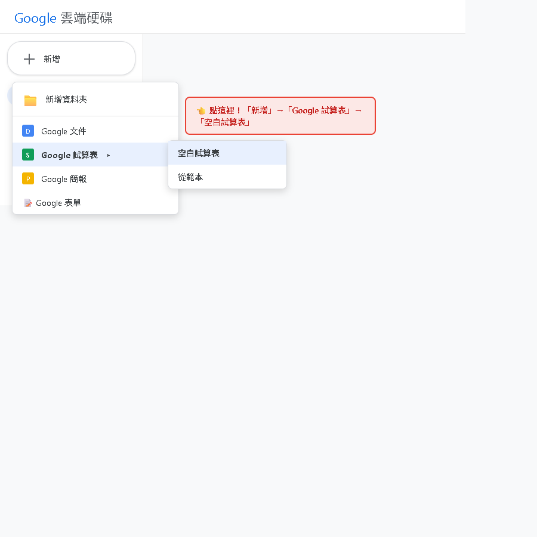

3. 在 Sheet1（工作表1）的 A 欄，貼上你的段考試題
   - A1 填入標題：「段考試題」
   - 從 A2 開始，每一列貼一道題目（含選項）

> **📸 圖 1-2：貼上段考題的 Google Sheets 畫面**
>
> 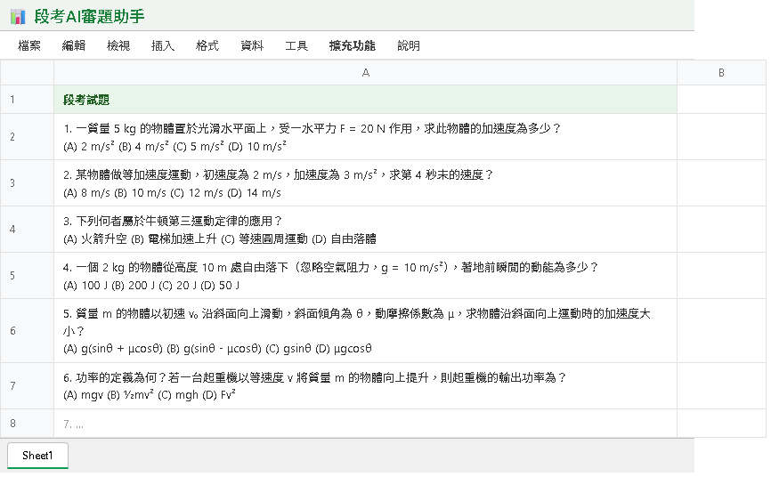

### Step 2：開啟 Apps Script 編輯器

1. 在 Google Sheets 上方選單列，點選「**擴充功能**」→「**Apps Script**」

> **📸 圖 1-3：開啟 Apps Script 編輯器**
>
> 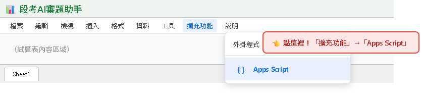

2. Apps Script 編輯器會在新分頁開啟
3. 將預設的 `myFunction` 全部刪除，準備貼上我們的程式碼

> **📸 圖 1-4：Apps Script 編輯器初始畫面**
>
> 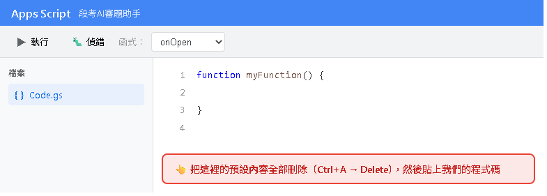

### Step 3：設定 Gemini API 金鑰

1. 前往 [Google AI Studio](https://aistudio.google.com/apikey) 取得 API 金鑰
2. 在 Apps Script 左側選單點選「**專案設定**」（齒輪圖示）
3. 向下捲動到「**指令碼屬性**」，點選「**新增指令碼屬性**」
4. 屬性名稱填入 `GEMINI_API_KEY`，值填入你的 API 金鑰

> **📸 圖 1-5：設定 API 金鑰**
>
> 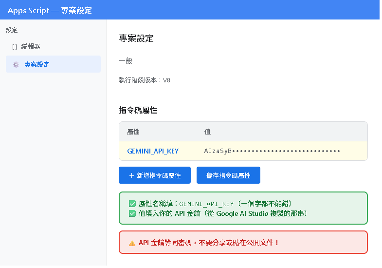

> ⚠️ **注意**：API 金鑰等同密碼，請勿分享給他人或貼在公開文件中。

### Step 4：貼上程式碼

> **程式碼在哪？** 打開 `GAS程式碼/工具1_段考AI審題助手.js` 這個檔案。
> **怎麼貼？** 打開檔案 → `Ctrl+A` 全選 → `Ctrl+C` 複製 → 回到 Apps Script 編輯器 → `Ctrl+A` 全選舊的 → `Ctrl+V` 貼上覆蓋 → `Ctrl+S` 儲存。

在 Apps Script 編輯器中，貼上以下程式碼：

```javascript
// ===== 段考 AI 審題助手 =====
// 使用 Gemini API 分析段考試題

// 取得 API 金鑰
function getApiKey() {
  return PropertiesService.getScriptProperties().getProperty('GEMINI_API_KEY');
}

// 建立自訂選單
function onOpen() {
  SpreadsheetApp.getUi()
    .createMenu('🤖 AI 審題助手')
    .addItem('📊 分析段考試題', 'analyzeExam')
    .addItem('ℹ️ 使用說明', 'showHelp')
    .addToUi();
}

// 使用說明
function showHelp() {
  const html = HtmlService.createHtmlOutput(`
    <h3>段考 AI 審題助手 使用說明</h3>
    <ol>
      <li>在 Sheet1 的 A 欄貼上段考試題（每列一題）</li>
      <li>點選選單「AI 審題助手」→「分析段考試題」</li>
      <li>等待 AI 分析完成（約 30 秒～1 分鐘）</li>
      <li>結果會自動產生在新的工作表中</li>
    </ol>
    <p><b>產出內容：</b></p>
    <ul>
      <li>雙向細目表（知識向度 × 認知層次）</li>
      <li>難易度分析（簡單/中等/困難比例）</li>
      <li>覆蓋率檢核與改進建議</li>
    </ul>
  `).setWidth(400).setHeight(350);
  SpreadsheetApp.getUi().showModalDialog(html, '使用說明');
}

// 主功能：分析段考試題
function analyzeExam() {
  const ui = SpreadsheetApp.getUi();
  const sheet = SpreadsheetApp.getActiveSpreadsheet().getSheetByName('Sheet1')
                || SpreadsheetApp.getActiveSpreadsheet().getSheets()[0];

  // 讀取 A 欄試題
  const lastRow = sheet.getLastRow();
  if (lastRow < 2) {
    ui.alert('請先在 A 欄貼上段考試題（從 A2 開始）');
    return;
  }

  const questions = sheet.getRange(2, 1, lastRow - 1, 1).getValues()
    .map(row => row[0])
    .filter(q => q.toString().trim() !== '');

  if (questions.length === 0) {
    ui.alert('未偵測到試題，請確認 A 欄已貼上題目。');
    return;
  }

  ui.alert(`已偵測到 ${questions.length} 題，開始 AI 分析...\n（約需 30 秒～1 分鐘，請稍候）`);

  // 組合試題文字
  const examText = questions.map((q, i) => `第${i+1}題：${q}`).join('\n\n');

  // 呼叫 Gemini API
  const analysis = callGemini(examText);

  if (analysis) {
    outputResults(analysis);
    ui.alert('✅ 分析完成！請查看新產生的工作表。');
  } else {
    ui.alert('❌ 分析失敗，請檢查 API 金鑰設定。');
  }
}

// 呼叫 Gemini API
function callGemini(examText) {
  const apiKey = getApiKey();
  if (!apiKey) {
    SpreadsheetApp.getUi().alert('請先設定 GEMINI_API_KEY（專案設定 → 指令碼屬性）');
    return null;
  }

  const url = `https://generativelanguage.googleapis.com/v1beta/models/gemini-2.5-flash:generateContent?key=${apiKey}`;

  const prompt = `你是一位專業的高中教育評量專家。請分析以下段考試題，並產出：

1. **雙向細目表**（JSON 格式）
   - 列：各知識單元/主題
   - 欄：認知層次（記憶、理解、應用、分析、評鑑、創造）
   - 值：對應的題號

2. **難易度分析**（JSON 格式）
   - 將每題分類為「簡單」「中等」「困難」
   - 統計各難度的題數與百分比

3. **覆蓋率檢核**
   - 哪些單元/主題出太多題？
   - 哪些單元/主題沒有出到？
   - 難度分布是否均衡？

4. **改進建議**
   - 具體建議如何調整出題

請用以下 JSON 格式回傳（確保是合法 JSON）：
{
  "雙向細目表": {
    "單元列表": ["單元A", "單元B", ...],
    "認知層次": ["記憶", "理解", "應用", "分析", "評鑑", "創造"],
    "對應題號": {
      "單元A": {"記憶": [1,2], "理解": [3], ...},
      ...
    }
  },
  "難易度分析": {
    "各題難度": {"1": "中等", "2": "簡單", ...},
    "統計": {"簡單": {"題數": 5, "百分比": "25%"}, "中等": {...}, "困難": {...}}
  },
  "覆蓋率檢核": {
    "出題偏多": ["..."],
    "未覆蓋": ["..."],
    "難度均衡性": "..."
  },
  "改進建議": ["建議1", "建議2", ...]
}

以下是段考試題：

${examText}`;

  const payload = {
    contents: [{ parts: [{ text: prompt }] }],
    generationConfig: {
      temperature: 0.2,
      maxOutputTokens: 8192
    }
  };

  const options = {
    method: 'post',
    contentType: 'application/json',
    payload: JSON.stringify(payload),
    muteHttpExceptions: true
  };

  try {
    const response = UrlFetchApp.fetch(url, options);
    const json = JSON.parse(response.getContentText());
    const text = json.candidates[0].content.parts[0].text;

    // 嘗試從回應中提取 JSON
    const jsonMatch = text.match(/\{[\s\S]*\}/);
    if (jsonMatch) {
      return JSON.parse(jsonMatch[0]);
    }
    return null;
  } catch (e) {
    Logger.log('Gemini API 錯誤：' + e.message);
    return null;
  }
}

// 將分析結果輸出到新工作表
function outputResults(analysis) {
  const ss = SpreadsheetApp.getActiveSpreadsheet();

  // --- 工作表：雙向細目表 ---
  let sheetTable = ss.getSheetByName('雙向細目表');
  if (sheetTable) sheetTable.clear();
  else sheetTable = ss.insertSheet('雙向細目表');

  const table = analysis['雙向細目表'];
  if (table) {
    const headers = ['單元 \\ 認知層次', ...table['認知層次']];
    sheetTable.getRange(1, 1, 1, headers.length).setValues([headers])
      .setBackground('#4285F4').setFontColor('white').setFontWeight('bold');

    const units = table['單元列表'] || [];
    units.forEach((unit, i) => {
      const row = [unit];
      (table['認知層次'] || []).forEach(level => {
        const nums = table['對應題號']?.[unit]?.[level] || [];
        row.push(nums.length > 0 ? nums.join(', ') : '—');
      });
      sheetTable.getRange(i + 2, 1, 1, row.length).setValues([row]);
    });

    sheetTable.autoResizeColumns(1, headers.length);
  }

  // --- 工作表：難易度分析 ---
  let sheetDiff = ss.getSheetByName('難易度分析');
  if (sheetDiff) sheetDiff.clear();
  else sheetDiff = ss.insertSheet('難易度分析');

  const diff = analysis['難易度分析'];
  if (diff) {
    // 各題難度
    sheetDiff.getRange(1, 1).setValue('各題難度分析')
      .setFontWeight('bold').setFontSize(12);
    sheetDiff.getRange(2, 1, 1, 2).setValues([['題號', '難度']])
      .setBackground('#34A853').setFontColor('white').setFontWeight('bold');

    const items = diff['各題難度'] || {};
    Object.entries(items).forEach(([num, level], i) => {
      sheetDiff.getRange(i + 3, 1, 1, 2).setValues([[`第 ${num} 題`, level]]);
    });

    // 統計
    const statsRow = Object.keys(items).length + 5;
    sheetDiff.getRange(statsRow, 1).setValue('統計摘要')
      .setFontWeight('bold').setFontSize(12);
    sheetDiff.getRange(statsRow + 1, 1, 1, 3).setValues([['難度', '題數', '百分比']])
      .setBackground('#FBBC04').setFontWeight('bold');

    const stats = diff['統計'] || {};
    let row = statsRow + 2;
    ['簡單', '中等', '困難'].forEach(level => {
      const s = stats[level] || {};
      sheetDiff.getRange(row, 1, 1, 3).setValues([[level, s['題數'] || 0, s['百分比'] || '0%']]);
      row++;
    });

    sheetDiff.autoResizeColumns(1, 3);
  }

  // --- 工作表：檢核與建議 ---
  let sheetAdvice = ss.getSheetByName('檢核與建議');
  if (sheetAdvice) sheetAdvice.clear();
  else sheetAdvice = ss.insertSheet('檢核與建議');

  const check = analysis['覆蓋率檢核'] || {};
  const advice = analysis['改進建議'] || [];

  sheetAdvice.getRange(1, 1).setValue('覆蓋率檢核')
    .setFontWeight('bold').setFontSize(12);

  let r = 2;
  sheetAdvice.getRange(r, 1).setValue('出題偏多的單元：').setFontWeight('bold');
  sheetAdvice.getRange(r, 2).setValue((check['出題偏多'] || ['無']).join('、'));
  r++;
  sheetAdvice.getRange(r, 1).setValue('未覆蓋的單元：').setFontWeight('bold');
  sheetAdvice.getRange(r, 2).setValue((check['未覆蓋'] || ['無']).join('、'));
  r++;
  sheetAdvice.getRange(r, 1).setValue('難度均衡性：').setFontWeight('bold');
  sheetAdvice.getRange(r, 2).setValue(check['難度均衡性'] || '—');
  r += 2;

  sheetAdvice.getRange(r, 1).setValue('改進建議')
    .setFontWeight('bold').setFontSize(12);
  r++;
  advice.forEach((a, i) => {
    sheetAdvice.getRange(r + i, 1).setValue(`${i + 1}. ${a}`);
  });

  sheetAdvice.autoResizeColumns(1, 2);
}
```

> **📸 圖 1-6：貼上程式碼後的 Apps Script 編輯器**
>
> 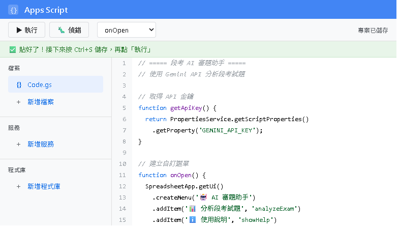

### Step 5：儲存並授權

1. 按下 `Ctrl + S` 儲存程式碼
2. 點選上方的「**執行**」按鈕（▶），選擇函式 `onOpen`
3. 首次執行會彈出「需要授權」的對話框
4. 點選「**審查權限**」→ 選擇你的 Google 帳號
5. 若出現「Google 尚未驗證這個應用程式」，點選「**進階**」→「**前往（不安全）**」
6. 點選「**允許**」完成授權

> **📸 圖 1-7：Google 授權流程**
>
> 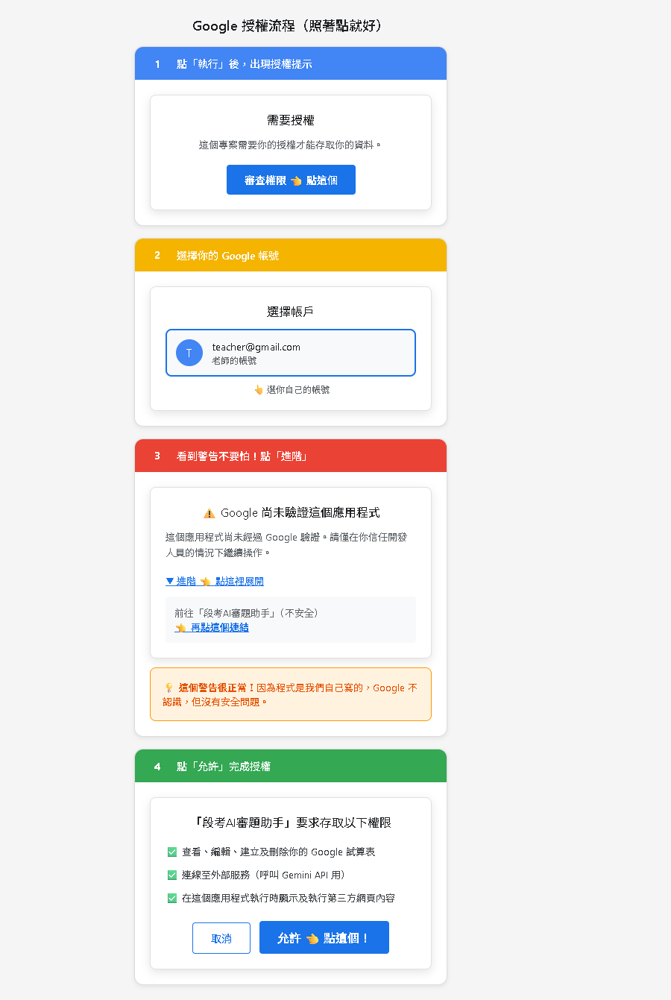

### Step 6：使用工具

1. 回到 Google Sheets，重新整理頁面（F5）
2. 上方選單列會出現「**🤖 AI 審題助手**」選單
3. 點選「**📊 分析段考試題**」
4. 等待約 30 秒～1 分鐘，AI 分析完成

> **📸 圖 1-8：自訂選單出現在 Google Sheets**
>
> 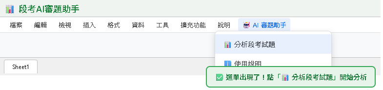

### 分析結果展示

分析完成後，會自動產生三個新的工作表：

#### 結果 1：雙向細目表

> **📸 圖 1-9：雙向細目表結果**
>
> 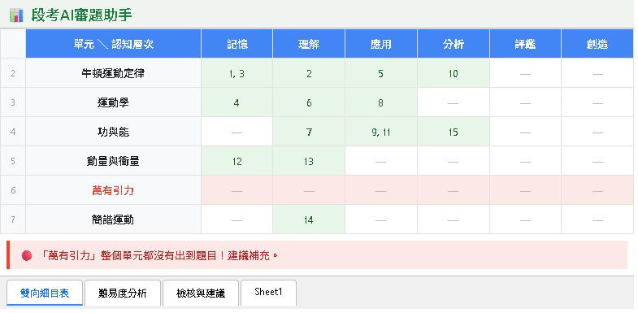

#### 結果 2：難易度分析

> **📸 圖 1-10：難易度分析結果**
>
> 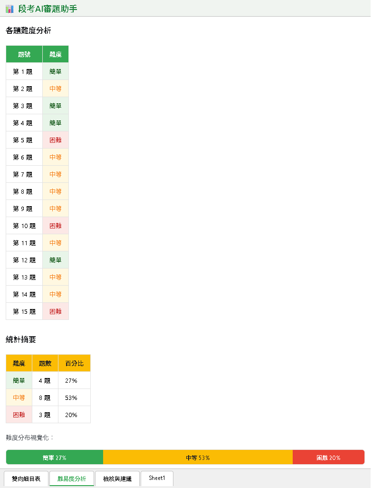

#### 結果 3：檢核與建議

> **📸 圖 1-11：檢核與建議結果**
>
> 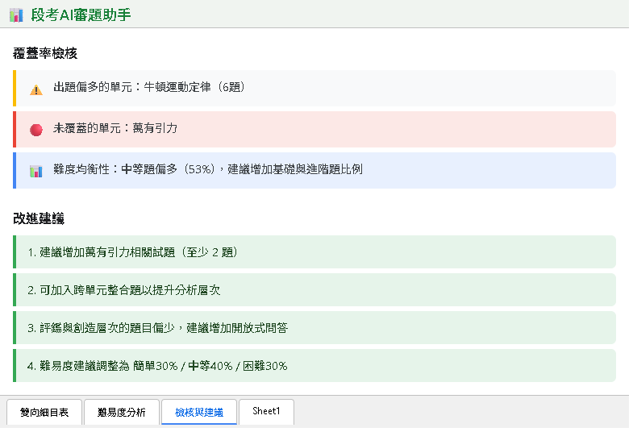

### Prompt 設計要點

本工具的 Prompt 有幾個關鍵設計：

| 設計要點 | 說明 | 為什麼重要 |
|---------|------|----------|
| 角色設定 | 「你是一位專業的高中教育評量專家」 | 讓 AI 以教育專業角度分析 |
| 結構化輸出 | 要求 JSON 格式 | 方便程式自動解析並填入試算表 |
| 明確項目 | 列出 4 大分析面向 | 避免 AI 遺漏或自由發揮 |
| 低溫度 | `temperature: 0.2` | 提升分析的穩定性和一致性 |

### 實作練習

> **🎯 任務：用自己的段考卷試試看！**
>
> 1. 找一份自己出過的段考卷（或使用國教署段考題庫）
> 2. 將題目貼入 Google Sheets 的 A 欄
> 3. 執行「AI 審題助手」→「分析段考試題」
> 4. 觀察分析結果，思考以下問題：
>    - 你的出題有哪些盲點？
>    - AI 的難度判定跟你的感覺一致嗎？
>    - 雙向細目表是否平衡？
>
> **沒有段考卷？** 可到 [國教署段考題庫](https://www.k12ea.gov.tw/Tw/SingleWindow/QuizList?filter=12445983-2A68-41E7-BC50-E7448925D%206BC&type=57) 下載一份。

> **📸 圖 1-12：國教署段考題庫網站**
>
> 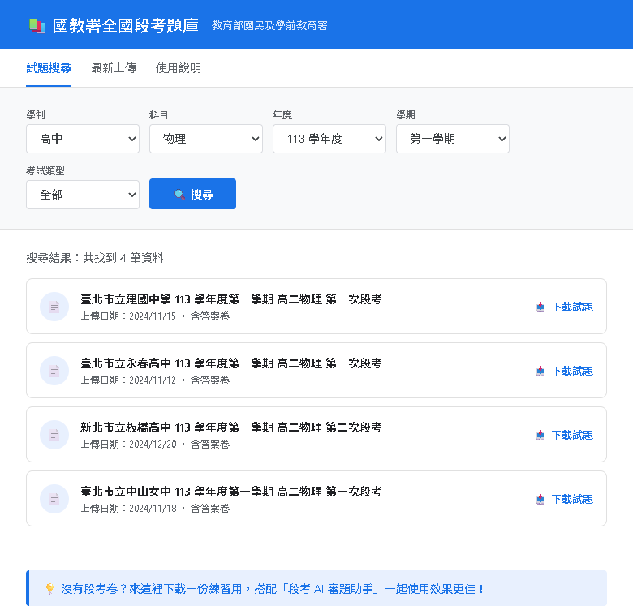

---

# 第二節：教材差異化——AI 改廠商簡報

## 2.1 問題情境

> 「廠商簡報太硬了，學生聽不懂。」
> 「建中跟永春怎麼可能用同一份簡報？」
> 「簡報做完以前很難改，現在呢？」

**廠商公版簡報的問題：**
- 一套簡報要賣給所有學校，無法針對學生程度調整
- 用詞太專業、步驟太快、舉例不生活化
- 以前改簡報等於重做，成本太高

**現在 AI 可以幫你：**
- 調整敘述難易度（專業語言 ↔ 口語化）
- 一張 PPT 拆成三張（降低認知負荷）
- 融入在地情境或生活化舉例
- **圖跟文字都可以改**

### 對應勝任感

```
廠商公版（太難）──→ AI 調整 ──→ 學生聽得懂 ──→ 勝任感 ↑
                      │
                 ┌────┼────┐
                 │    │    │
              降低難度 拆步驟 加情境
```

## 2.2 使用 Gemini 改簡報：三種策略

### 策略一：調整難度——專業語言 → 口語化

**Prompt 範例：**

```
請將以下教學內容改寫為適合高中一年級學生的程度。

改寫要求：
1. 將專業術語替換為日常用語，第一次出現時在括號中保留原術語
2. 句子長度不超過 20 字
3. 每個概念搭配一個生活中的例子
4. 語氣親切，像老師在課堂上對學生說話

原始內容：
「牛頓第二運動定律描述了物體所受淨力與其加速度之間的關係。
當作用於物體的淨力為 F，物體質量為 m 時，物體的加速度 a = F/m。」

請改寫：
```

**AI 改寫結果（預期）：**

> 想像你在推購物車 🛒
> 推的力氣越大，車子跑越快——這就是「牛頓第二定律」的核心概念。
>
> 用數學來說：
> **加速度 = 力 ÷ 質量**（a = F/m）
>
> 白話翻譯：
> - 推越用力（F 越大）→ 加速越快
> - 車子越重（m 越大）→ 加速越慢
>
> 所以，推空的購物車比推滿的輕鬆多了吧？

> **📸 圖 2-1：Gemini 改寫前後對比**
>
> 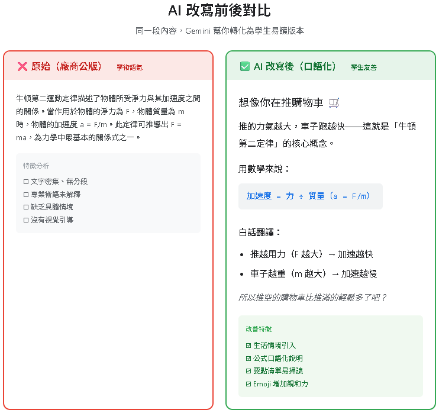

### 策略二：拆步驟——一張 PPT → 三張

**Prompt 範例：**

```
以下是一張簡報的內容，資訊量太大。請幫我拆成 3 張簡報，
每張只講一個核心概念，適合高中生逐步理解。

每張簡報請提供：
- 標題（10 字以內）
- 重點（3 個要點，每點不超過 15 字）
- 講者備註（老師上課可以說的話，50 字以內）

原始簡報內容：
「功與能的關係：當一個力作用於物體，使物體沿力的方向移動一段距離時，
我們說這個力對物體作了功。功的計算公式為 W = F × d × cosθ。
功的單位為焦耳（J）。動能定理告訴我們，合力所作的功等於物體動能的變化量。
Wnet = ΔKE = ½mv₂² - ½mv₁²」
```

> **📸 圖 2-2：一張拆三張的示意圖**
>
> 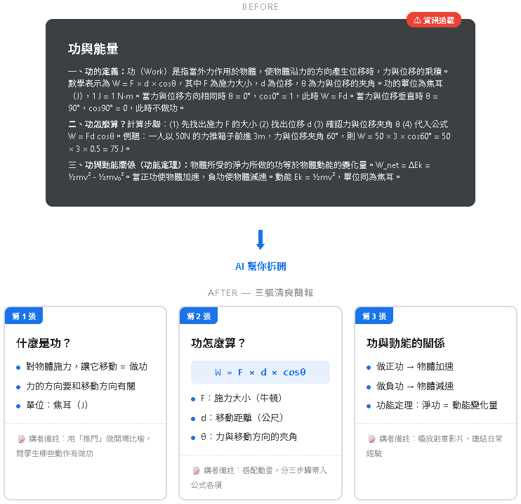

### 策略三：融入在地情境

**Prompt 範例：**

```
請將以下物理概念的舉例，替換為與台北市永春高中學生生活相關的情境。

考慮以下在地元素：
- 學校附近：象山步道、松山車站、信義商圈
- 學生日常：搭捷運上學、體育課、園遊會
- 時事或流行文化

原始舉例：
「一台質量 1000 公斤的汽車，以 20 m/s 的速度行駛...」

請改寫為在地化版本，保留相同的物理概念和計算：
```

> **📸 圖 2-3：在地化情境改寫**
>
> 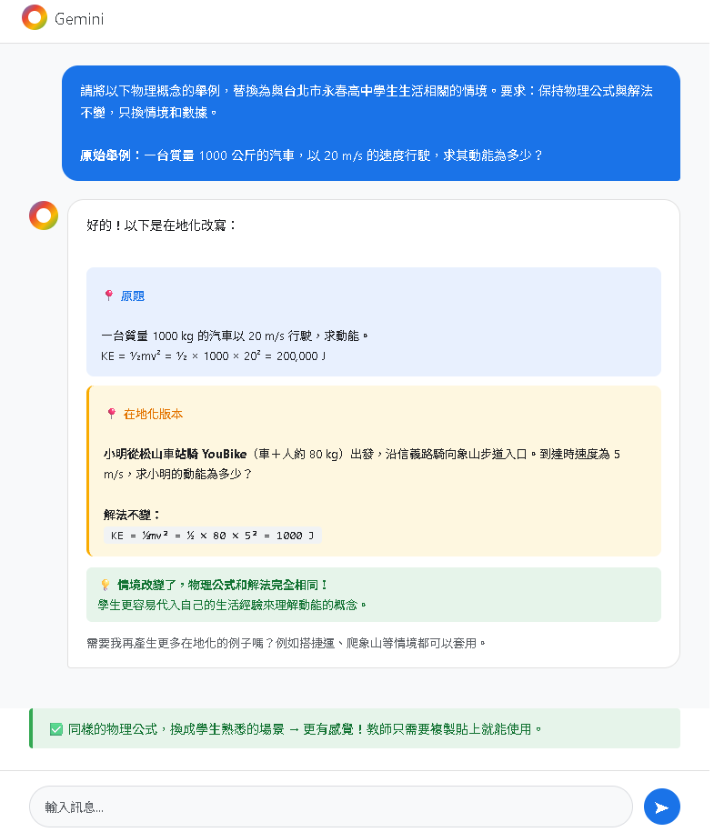

## 2.3 進階示範：使用 Gemini CLI 批次處理

如果你有很多份簡報要改，可以用 Gemini CLI 批次處理：

```bash
# 安裝 Gemini CLI（需要 Node.js 18+）
npm install -g @anthropic-ai/gemini-cli

# 批次改寫簡報內容（把 slide_content.txt 換成你的檔案）
gemini "請將以下內容改寫為適合高中一年級生的口語化版本：$(cat slide_content.txt)"
```

> **白話說：** Gemini CLI 就是在終端機（黑色畫面）裡直接跟 AI 對話。
> 適合一次處理很多份檔案，不用一份一份貼到網頁。
> 如果你不熟終端機，用 [Gemini 網頁版](https://gemini.google.com/) 一樣可以達到效果，只是要手動一份份貼。

> **📸 圖 2-4：Gemini CLI 操作畫面**
>
> 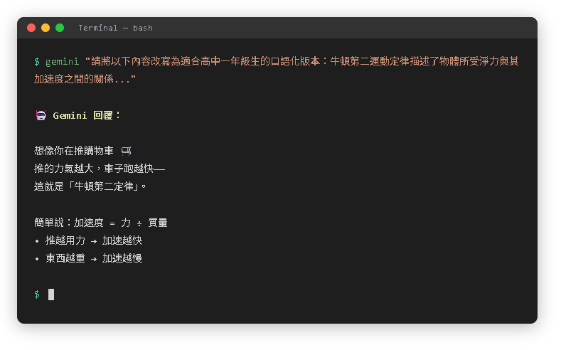

## 2.4 實作練習

> **🎯 任務：改一份你的教材！**
>
> 1. 準備一段教學內容（可以是你的簡報文字、講義文字）
> 2. 選擇上述三種策略之一（或自由組合）
> 3. 到 [Gemini](https://gemini.google.com/) 或 [Google AI Studio](https://aistudio.google.com/) 實際操作
> 4. 比較改寫前後的差異
>
> **思考：**
> - 改寫後的內容適合你的學生嗎？
> - 需要再調整什麼？
> - 哪些部分 AI 改得好，哪些需要你修改？

---

# 第三節：動態評量產生器

## 3.1 什麼是動態評量（Dynamic Assessment）？

### 傳統評量 vs. 動態評量

```
傳統評量（靜態）                    動態評量（動態）
┌──────────────┐               ┌──────────────────────┐
│ 出 20 題     │               │ 出 1 題              │
│ 每題 5 分    │               │     │                 │
│ 會就會       │               │  答對 → 5 分（滿分）   │
│ 不會就 0 分  │               │     │                 │
│              │               │  答錯 → 提示 1         │
│ 結果：       │               │     │ 答對 → 4 分      │
│ 「你考 30 分」│               │     │                 │
│              │               │  再錯 → 提示 2（給公式）│
│              │               │     │ 答對 → 3 分      │
│              │               │     │                 │
│              │               │  再錯 → 提示 3（帶數字）│
│              │               │     │ 答對 → 1 分      │
│              │               │                      │
│              │               │ 結果：精準知道程度     │
│              │               │ + 學生邊做邊學        │
└──────────────┘               └──────────────────────┘
```

### 計分邏輯

| 作答情況 | 得分 | 代表意義 |
|---------|:---:|---------|
| 不用任何提示就答對 | **5 分** | 完全掌握 |
| 看了第 1 個提示後答對 | **4 分** | 小概念卡住，點一下就通 |
| 看了第 2 個提示（給公式）後答對 | **3 分** | 知道方向但忘了公式 |
| 看了第 3 個提示（帶數字）後答對 | **1 分** | 基礎薄弱，但還是能得分 |
| 全部提示都看了還是答錯 | **0 分** | 需要額外補救 |

> **核心價值：所有學生都能得分，都能邊做邊學。**
> 這就是勝任感的來源——「我雖然需要提示，但我最後做出來了！」

### 動態評量的精神：像師徒對話

想像一位老師坐在你旁邊：

> **老師**：這題你會嗎？
> **學生**：呃...不太確定。
> **老師**：提示你一下，這題要用到牛頓定律喔。
> **學生**：喔！那 F = ma，所以...（開始算）
> **老師**：對了！你其實會，只是需要一個方向。

**動態評量就是把這個過程系統化、自動化。**

## 3.2 工具 ②：動態評量產生器

### 功能概覽

```
┌─────────────┐    ┌──────────┐    ┌──────────────┐    ┌──────────────┐
│Google Sheets │ →  │   GAS +  │ →  │ Google Forms │ →  │ 自動計分     │
│ 輸入知識點   │    │ Gemini   │    │ （含分支邏輯）│    │ + 程度報表   │
│             │    │ 產生題目  │    │  學生作答    │    │             │
│             │    │ + 3層提示 │    │             │    │             │
└─────────────┘    └──────────┘    └──────────────┘    └──────────────┘
```

### Step 1：建立 Google Sheets

1. 新增一份 Google Sheets，命名為「動態評量產生器」
2. 在 Sheet1 設定知識點輸入格式：

| A 欄 | B 欄 | C 欄 |
|------|------|------|
| 科目 | 單元 | 知識點 |
| 物理 | 牛頓運動定律 | F=ma 的應用 |
| 物理 | 牛頓運動定律 | 摩擦力計算 |
| 物理 | 功與能 | 動能定理 |

> **📸 圖 3-1：知識點輸入表格**
>
> 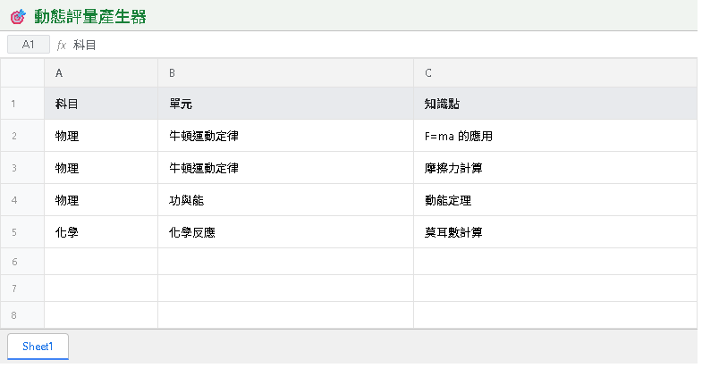

### Step 2：設定 Apps Script

1. 開啟「擴充功能」→「Apps Script」
2. 設定 `GEMINI_API_KEY`（同工具 ① 的方法）
3. 貼上程式碼：

> **程式碼在哪？** 打開 `GAS程式碼/工具2_動態評量產生器.js` 這個檔案。
> **怎麼貼？** `Ctrl+A` 全選 → `Ctrl+C` 複製 → 回到 Apps Script → `Ctrl+A` → `Ctrl+V` 貼上 → `Ctrl+S` 儲存。

```javascript
// ===== 動態評量產生器 =====

function onOpen() {
  SpreadsheetApp.getUi()
    .createMenu('🎯 動態評量')
    .addItem('📝 產生動態評量題目', 'generateQuestions')
    .addItem('📋 建立 Google Form', 'createForm')
    .addItem('📊 計算成績', 'calculateScores')
    .addToUi();
}

// 產生動態評量題目 + 三層提示
function generateQuestions() {
  const ui = SpreadsheetApp.getUi();
  const sheet = SpreadsheetApp.getActiveSpreadsheet().getSheets()[0];
  const lastRow = sheet.getLastRow();

  if (lastRow < 2) {
    ui.alert('請先在 Sheet1 填入知識點（A:科目, B:單元, C:知識點）');
    return;
  }

  const data = sheet.getRange(2, 1, lastRow - 1, 3).getValues();
  const knowledgePoints = data
    .filter(row => row[2].toString().trim() !== '')
    .map(row => ({ subject: row[0], unit: row[1], point: row[2] }));

  ui.alert(`開始為 ${knowledgePoints.length} 個知識點產生動態評量題目...\n（每個知識點約需 10 秒）`);

  // 建立或清除結果工作表
  const ss = SpreadsheetApp.getActiveSpreadsheet();
  let resultSheet = ss.getSheetByName('題目與提示');
  if (resultSheet) resultSheet.clear();
  else resultSheet = ss.insertSheet('題目與提示');

  // 設定表頭
  const headers = ['知識點', '題目', '正確答案',
                   '提示1（方向提示）', '提示1後答案',
                   '提示2（給公式）', '提示2後答案',
                   '提示3（帶數字）', '提示3後答案'];
  resultSheet.getRange(1, 1, 1, headers.length).setValues([headers])
    .setBackground('#4285F4').setFontColor('white').setFontWeight('bold');

  // 逐一產生題目
  let currentRow = 2;
  knowledgePoints.forEach(kp => {
    const result = generateOneQuestion(kp);
    if (result) {
      resultSheet.getRange(currentRow, 1, 1, headers.length).setValues([result]);
      currentRow++;
    }
  });

  resultSheet.autoResizeColumns(1, headers.length);
  ui.alert(`✅ 已產生 ${currentRow - 2} 道動態評量題目！\n請查看「題目與提示」工作表。`);
}

// 為單一知識點產生題目
function generateOneQuestion(kp) {
  const apiKey = PropertiesService.getScriptProperties().getProperty('GEMINI_API_KEY');
  const url = `https://generativelanguage.googleapis.com/v1beta/models/gemini-2.5-flash:generateContent?key=${apiKey}`;

  const prompt = `你是一位高中${kp.subject}老師，請針對「${kp.unit} - ${kp.point}」設計一道動態評量題目。

請提供以下內容（用 JSON 格式回覆）：

{
  "題目": "一道計算題或應用題（含具體數字，約 50-80 字）",
  "正確答案": "完整的正確答案",
  "提示1_方向提示": "不給公式，只提示解題方向（如：這題要用到牛頓第二定律喔）",
  "提示1後答案": "看了提示1之後的正確答案（與原答案相同）",
  "提示2_給公式": "給出需要用到的公式（如：F = ma，其中 F 是力，m 是質量，a 是加速度）",
  "提示2後答案": "看了提示2之後的正確答案",
  "提示3_帶數字": "直接幫學生把數字代入公式，只差最後一步計算（如：F = 5 × 2 = ?）",
  "提示3後答案": "最後一步的答案"
}

要求：
- 題目要有具體數字，學生可以實際計算
- 三層提示要有明確的層次差異
- 提示越多，解題越容易
- 即使看了全部提示，學生仍需要做最後一步才能得到答案`;

  const payload = {
    contents: [{ parts: [{ text: prompt }] }],
    generationConfig: { temperature: 0.3, maxOutputTokens: 2048 }
  };

  try {
    const response = UrlFetchApp.fetch(url, {
      method: 'post',
      contentType: 'application/json',
      payload: JSON.stringify(payload),
      muteHttpExceptions: true
    });

    const json = JSON.parse(response.getContentText());
    const text = json.candidates[0].content.parts[0].text;
    const match = text.match(/\{[\s\S]*\}/);

    if (match) {
      const data = JSON.parse(match[0]);
      return [
        kp.point,
        data['題目'],
        data['正確答案'],
        data['提示1_方向提示'],
        data['提示1後答案'],
        data['提示2_給公式'],
        data['提示2後答案'],
        data['提示3_帶數字'],
        data['提示3後答案']
      ];
    }
  } catch (e) {
    Logger.log('錯誤：' + e.message);
  }
  return null;
}

// 建立 Google Form（含分支邏輯）
function createForm() {
  const ui = SpreadsheetApp.getUi();
  const ss = SpreadsheetApp.getActiveSpreadsheet();
  const sheet = ss.getSheetByName('題目與提示');

  if (!sheet) {
    ui.alert('請先產生題目（點選「產生動態評量題目」）');
    return;
  }

  const lastRow = sheet.getLastRow();
  if (lastRow < 2) {
    ui.alert('沒有可用的題目。');
    return;
  }

  // 建立 Google Form
  const form = FormApp.create('動態評量 - ' + new Date().toLocaleDateString('zh-TW'));
  form.setDescription('這是一份動態評量，答錯時會獲得提示，幫助你一步步解題。\n每題滿分 5 分，使用提示會扣分，但你一定能得到分數！');
  form.setIsQuiz(false); // 我們用自己的計分邏輯

  const data = sheet.getRange(2, 1, lastRow - 1, 9).getValues();

  data.forEach((row, idx) => {
    const questionNum = idx + 1;
    const [point, question, answer, hint1, ans1, hint2, ans2, hint3, ans3] = row;

    // 加入題目說明
    form.addSectionHeaderItem()
      .setTitle(`第 ${questionNum} 題（知識點：${point}）`);

    // 主題目
    form.addParagraphTextItem()
      .setTitle(`${question}`)
      .setHelpText('請直接作答。如果不確定，可以先試試看！')
      .setRequired(true);

    // 是否需要提示
    const needHint = form.addMultipleChoiceItem()
      .setTitle(`第 ${questionNum} 題：需要提示嗎？`)
      .setHelpText('選擇「不需要」可得滿分 5 分；選擇「需要提示」會顯示提示但扣 1 分');

    // 提示頁面
    const hintPage = form.addPageBreakItem()
      .setTitle(`第 ${questionNum} 題 - 提示區`);

    form.addSectionHeaderItem()
      .setTitle(`💡 提示 1：${hint1}`);

    form.addParagraphTextItem()
      .setTitle(`看了提示後，請再試一次：`)
      .setRequired(false);

    form.addSectionHeaderItem()
      .setTitle(`📐 提示 2：${hint2}`);

    form.addParagraphTextItem()
      .setTitle(`有了公式，請再算一次：`)
      .setRequired(false);

    form.addSectionHeaderItem()
      .setTitle(`🔢 提示 3：${hint3}`);

    form.addParagraphTextItem()
      .setTitle(`數字都代好了，最後一步是？`)
      .setRequired(false);
  });

  // 記錄 Form URL
  const formUrl = form.getPublishedUrl();
  const editUrl = form.getEditUrl();

  let urlSheet = ss.getSheetByName('表單連結');
  if (urlSheet) urlSheet.clear();
  else urlSheet = ss.insertSheet('表單連結');

  urlSheet.getRange(1, 1).setValue('學生作答連結：').setFontWeight('bold');
  urlSheet.getRange(1, 2).setValue(formUrl);
  urlSheet.getRange(2, 1).setValue('編輯連結：').setFontWeight('bold');
  urlSheet.getRange(2, 2).setValue(editUrl);
  urlSheet.autoResizeColumns(1, 2);

  ui.alert(`✅ Google Form 已建立！\n\n學生連結：${formUrl}\n\n（連結也已記錄在「表單連結」工作表）`);
}

// 計算成績
function calculateScores() {
  const ui = SpreadsheetApp.getUi();
  ui.alert('📊 計分功能說明：\n\n' +
    '請在 Google Form 收到回覆後：\n' +
    '1. 開啟表單回覆的 Google Sheets\n' +
    '2. 根據學生使用提示的情況計分：\n' +
    '   • 不用提示答對 = 5 分\n' +
    '   • 用 1 個提示答對 = 4 分\n' +
    '   • 用 2 個提示答對 = 3 分\n' +
    '   • 用 3 個提示答對 = 1 分\n' +
    '   • 全部提示後仍答錯 = 0 分\n\n' +
    '（未來版本將支援全自動計分）');
}
```

> **📸 圖 3-2：動態評量的 Google Sheets 選單**
>
> 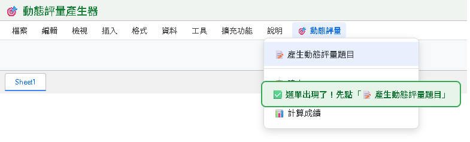

### Step 3：填入知識點並產生題目

1. 在 Sheet1 填入你想出題的知識點
2. 點選「🎯 動態評量」→「📝 產生動態評量題目」
3. 等待 AI 逐一產生題目（每個知識點約 10 秒）

> **📸 圖 3-3：產生完成的「題目與提示」工作表**
>
> 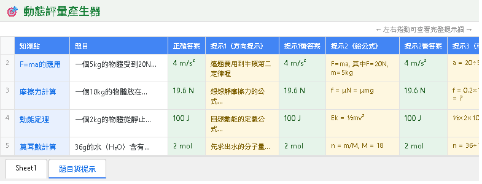

### Step 4：建立 Google Form

1. 確認「題目與提示」工作表內容正確
2. 點選「🎯 動態評量」→「📋 建立 Google Form」
3. 系統自動建立含分支邏輯的 Google Form

> **📸 圖 3-4：自動建立的 Google Form 預覽**
>
> 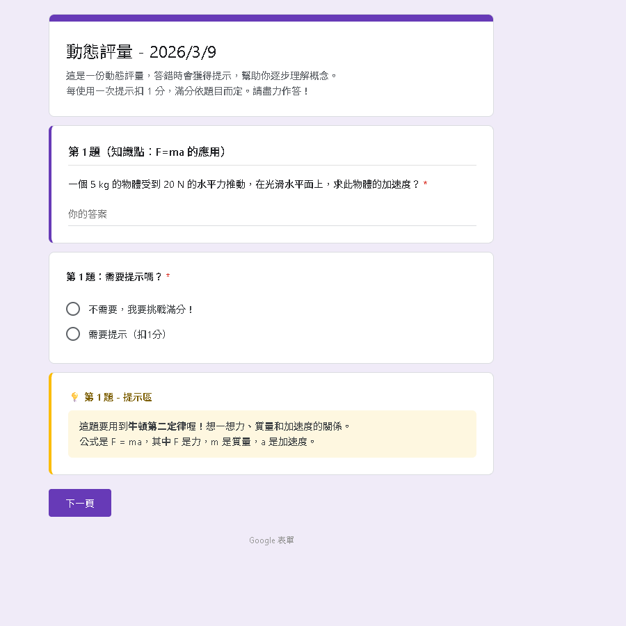

### Step 5：學生作答流程

學生的作答體驗如下：

```
進入 Google Form
       │
  ┌────▼────┐
  │ 看到題目  │
  │ 先自己算  │
  └────┬────┘
       │
  ┌────▼────────────┐
  │ 需要提示嗎？      │
  ├─── 不需要 ───────→  寫下答案（得 5 分）
  │                   │
  └─── 需要提示 ──────→  看到「提示 1：方向提示」
                      │  重新作答（得 4 分）
                      │
                      ├→ 看到「提示 2：給公式」
                      │  重新作答（得 3 分）
                      │
                      └→ 看到「提示 3：帶數字」
                         做最後一步（得 1 分）
```

> **📸 圖 3-5：學生作答畫面（手機版）**
>
> 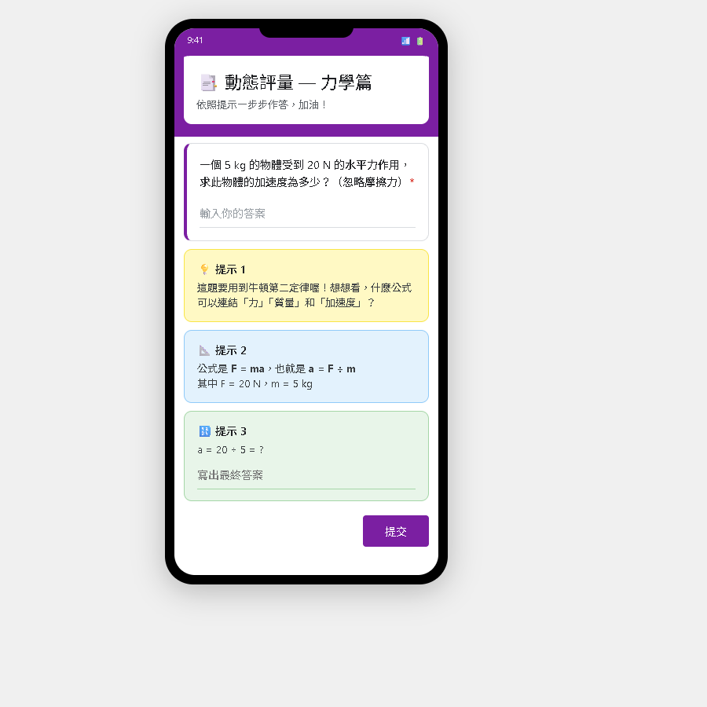

### 動態評量 × 差異化教學

| 學生程度 | 使用提示數 | 得分 | 學習收穫 |
|---------|:--------:|:---:|---------|
| 高成就 | 0 個 | 5 分 | 確認已掌握 |
| 中等 | 1～2 個 | 3～4 分 | 釐清卡住的環節 |
| 低成就 | 3 個 | 1 分 | 跟著提示學會解題 |

> **每個程度的學生都有收穫、都能得分 → 勝任感！**

### 實作練習

> **🎯 任務：為你的一個單元，做一組動態評量！**
>
> 1. 在 Sheet1 填入 2～3 個知識點
> 2. 執行「產生動態評量題目」
> 3. 檢查 AI 產生的題目和提示是否合理
>    - 提示有沒有層次感？
>    - 最後一個提示是否真的只差一步？
> 4. （選做）建立 Google Form 並預覽
>
> **思考：**
> - 你會怎麼跟學生介紹這種評量方式？
> - 這種「邊做邊學」的評量，適合用在什麼時機？

---

---

# 第四節：多元評量 Rubric + AI 學生回饋系統

## 4.1 【自主性】多元評量設計

### 核心概念：選擇增加動機

回顧上午的動機理論：

> **自主性（Autonomy）**：當學生覺得「這是我自己選的」，動機會提升。

### 三種評量形式（對應多元智能）

| 評量形式 | 適合的學生 | 呈現方式 |
|---------|----------|---------|
| 📝 **文字報告型** | 語文智能、邏輯數學智能 | 書面研究報告、實驗報告 |
| 🎨 **視覺圖像型** | 空間智能、自然觀察智能 | 概念圖、漫畫、資訊圖表 |
| 🎙️ **口說 Podcast 型** | 人際智能、音樂智能 | 3 分鐘 Podcast 說明 |

### 用 Gemini 產出不同形式的 Rubric

**Prompt 範例——產出三種 Rubric：**

```
你是一位高中物理老師。學生完成「牛頓運動定律」單元後，
需要繳交一份學習成果報告。

我提供三種評量形式讓學生選擇：
1. 文字報告（2 頁 A4）
2. 視覺圖像（概念圖或 4 格漫畫）
3. 口說 Podcast（3 分鐘錄音）

請分別為這三種形式設計評分規準（Rubric），
每種都要有：
- 3～4 個評分面向
- 每個面向分為「優（5分）」「中（3分）」「再加強（1分）」三個等級
- 具體描述每個等級的表現標準

格式請用 Markdown 表格。

注意：三種形式要等值，不能某種形式特別容易拿高分。
```

> **📸 圖 4-1：三種 Rubric 的 Gemini 產出結果**
>
> 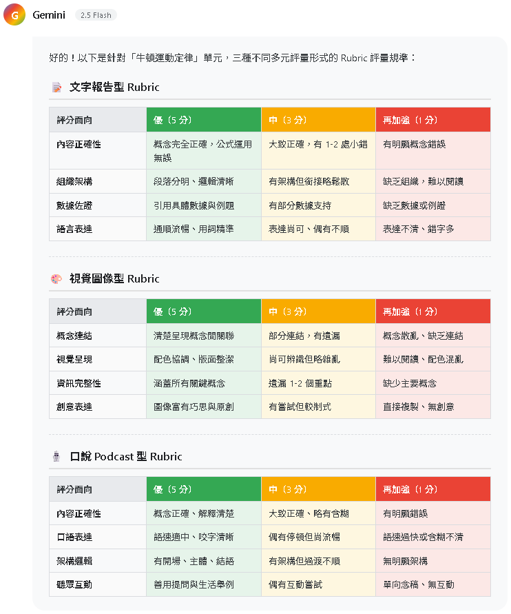

### 選擇策略：加一個更難選項

還記得「滷肉飯 + 炸豆腐」嗎？

```
原本的選項：                        加上更難選項後：
┌────────────────┐              ┌────────────────┐
│ A. 文字報告    │              │ A. 文字報告    │ ← 學生選這個
│ B. 概念圖      │              │ B. 概念圖      │    覺得「還好嘛」
│ C. Podcast     │              │ C. Podcast     │
│                │              │ D. 文字報告    │ ← 新增的更難選項
│                │              │    ＋ Podcast   │    （沒人選沒關係）
└────────────────┘              └────────────────┘
```

> 加上 D 選項後，學生會覺得 A/B/C 都相對輕鬆，選擇動機提升。

## 4.2 工具 ③：AI 學生回饋系統

### 問題情境

> 「AI 改出來都是最高分！」
> 「AI 寫的評語都好好聽，但學生根本沒進步。」
> 「我想讓 AI 幫忙改，但它太討好了。」

### 為什麼 AI 會討好？

AI 語言模型的訓練過程中，「友善」是被獎勵的行為。所以當你問：

```
❌ 錯誤問法：「請幫我評分這份報告」
→ AI：「這份報告寫得很好！結構清晰、內容豐富...」（全部優點）

✅ 正確問法：「請指出這份報告哪裡不好。如果你要扣分，會在哪裡扣？」
→ AI：「第二段的論述缺乏具體數據佐證，建議...」（有建設性的批評）
```

### 解決 AI 討好的 Prompt 技巧

| 技巧 | 範例 |
|------|------|
| **明確要求找缺點** | 「這份作品哪裡不好？至少列出 3 點需要改進的地方」 |
| **模擬扣分** | 「如果你是嚴格的閱卷老師，會在哪裡扣分？」 |
| **對照 Rubric 逐項評** | 「根據以下評分規準，逐項評估並給分」 |
| **要求先批評再稱讚** | 「請先列出缺點，再列出優點，最後給改進建議」 |
| **設定角色** | 「你是一位重視學術嚴謹度的資深教授」 |

### 架構：NotebookLM + GAS + Gemini

```
┌──────────────┐
│ NotebookLM   │  ← 上傳課程資料（課本、講義、標準答案）
│（知識庫基準）  │     建立「這個單元該學什麼」的基準
└──────┬───────┘
       │ 參考
       ▼
┌──────────────┐    ┌──────────┐    ┌──────────────┐
│ Google Sheets │ →  │ GAS +    │ →  │ 個人化回饋   │
│ 貼上 Rubric   │    │ Gemini   │    │ • 優點       │
│ + 學生作品    │    │ API      │    │ • 待改進     │
│              │    │          │    │ • 具體建議   │
│              │    │          │    │ • 鼓勵語     │
└──────────────┘    └──────────┘    └──────────────┘
```

### Part A：NotebookLM 設定

> **完整指引文件：** 詳細步驟請見 `指引/NotebookLM設定指引.md`，以下為重點摘要。

#### 什麼是 NotebookLM？

Google 的 AI 筆記工具，可以上傳文件建立專屬知識庫，AI 會**只根據你上傳的資料**來回答問題（不會瞎掰）。

#### 設定步驟

1. 前往 [NotebookLM](https://notebooklm.google.com/)
2. 點選「**新增筆記本**」
3. 上傳課程相關資料：
   - 課本該章節的 PDF
   - 你的講義或簡報
   - 評分規準（Rubric）
   - 標準答案或優秀作品範例

> **📸 圖 4-2：NotebookLM 新增筆記本**
>
> 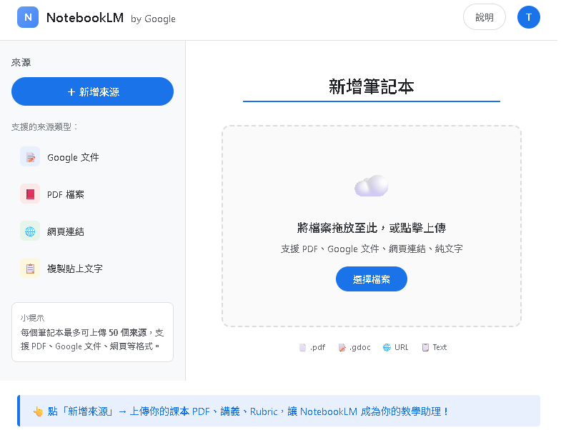

4. 上傳完成後，在 NotebookLM 中測試：

```
測試問法：「這個單元的核心概念是什麼？學生應該學會什麼？」
```

> **📸 圖 4-3：NotebookLM 上傳資料後的畫面**
>
> 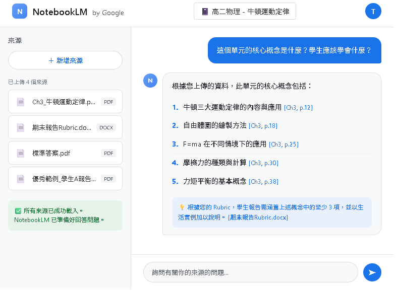

5. 記下這個筆記本的重點摘要，作為後續 AI 回饋的參考基準

### Part B：GAS 回饋工具

#### Step 1：建立 Google Sheets

1. 新增 Google Sheets，命名為「AI 學生回饋系統」
2. 設定以下欄位：

| A 欄 | B 欄 | C 欄 | D 欄 | E 欄 |
|------|------|------|------|------|
| 學生姓名 | 評量形式 | Rubric | 學生作品內容 | AI 回饋（自動產生）|

> **📸 圖 4-4：回饋系統的 Google Sheets 格式**
>
> 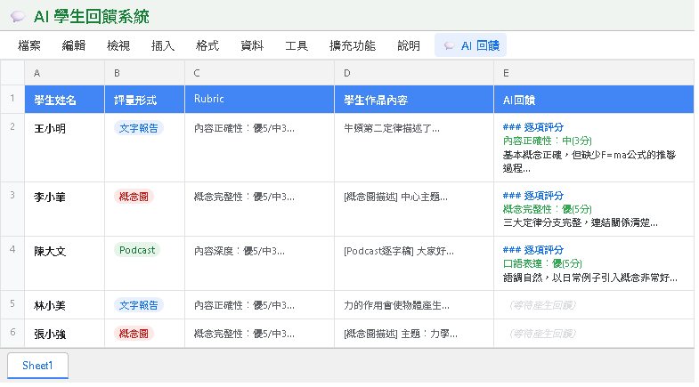

#### Step 2：貼上程式碼

> **程式碼在哪？** 打開 `GAS程式碼/工具3_AI學生回饋系統.js` 這個檔案。
> **怎麼貼？** `Ctrl+A` 全選 → `Ctrl+C` 複製 → 回到 Apps Script → `Ctrl+A` → `Ctrl+V` 貼上 → `Ctrl+S` 儲存。

```javascript
// ===== AI 學生回饋系統 =====

function onOpen() {
  SpreadsheetApp.getUi()
    .createMenu('💬 AI 回饋')
    .addItem('🔄 產生個人化回饋', 'generateFeedback')
    .addItem('📧 批次產生全部回饋', 'generateAllFeedback')
    .addToUi();
}

// 產生單一學生的回饋
function generateFeedback() {
  const ui = SpreadsheetApp.getUi();
  const sheet = SpreadsheetApp.getActiveSpreadsheet().getSheets()[0];
  const row = SpreadsheetApp.getActiveRange().getRow();

  if (row < 2) {
    ui.alert('請選取學生資料列（第 2 列以下）再執行。');
    return;
  }

  const data = sheet.getRange(row, 1, 1, 4).getValues()[0];
  const [name, format, rubric, work] = data;

  if (!work || work.toString().trim() === '') {
    ui.alert('該列的「學生作品內容」(D欄) 是空的。');
    return;
  }

  ui.alert(`正在為 ${name} 產生個人化回饋...`);

  const feedback = callGeminiFeedback(name, format, rubric, work);

  if (feedback) {
    sheet.getRange(row, 5).setValue(feedback);
    ui.alert(`✅ 已為 ${name} 產生回饋！請查看 E 欄。`);
  } else {
    ui.alert('❌ 回饋產生失敗。');
  }
}

// 批次產生全部回饋
function generateAllFeedback() {
  const ui = SpreadsheetApp.getUi();
  const sheet = SpreadsheetApp.getActiveSpreadsheet().getSheets()[0];
  const lastRow = sheet.getLastRow();

  if (lastRow < 2) {
    ui.alert('請先填入學生資料。');
    return;
  }

  let count = 0;
  for (let row = 2; row <= lastRow; row++) {
    const data = sheet.getRange(row, 1, 1, 5).getValues()[0];
    const [name, format, rubric, work, existing] = data;

    // 跳過已有回饋的或空白的
    if (existing.toString().trim() !== '' || work.toString().trim() === '') continue;

    const feedback = callGeminiFeedback(name, format, rubric, work);
    if (feedback) {
      sheet.getRange(row, 5).setValue(feedback);
      count++;
    }

    // 避免 API 速率限制
    Utilities.sleep(2000);
  }

  ui.alert(`✅ 完成！共產生 ${count} 份個人化回饋。`);
}

// 呼叫 Gemini API 產生回饋
function callGeminiFeedback(name, format, rubric, work) {
  const apiKey = PropertiesService.getScriptProperties().getProperty('GEMINI_API_KEY');
  const url = `https://generativelanguage.googleapis.com/v1beta/models/gemini-2.5-flash:generateContent?key=${apiKey}`;

  const prompt = `你是一位嚴謹但溫暖的高中老師，正在批改學生的作品。

## 重要指示
- 你必須誠實指出作品的不足之處
- 不要全部都說好話
- 根據 Rubric 逐項評估，有缺失就要指出
- 回饋的目的是幫助學生進步，不是讓他開心

## 學生資訊
- 姓名：${name}
- 評量形式：${format}

## 評分規準（Rubric）
${rubric}

## 學生作品
${work}

## 請依照以下格式回饋：

### 📊 逐項評分
（根據 Rubric 的每個面向，給出等級和簡短說明）

### ✅ 做得好的地方（2～3 點）
（具體指出優點，引用作品中的內容）

### ⚠️ 需要改進的地方（2～3 點）
（明確指出不足，說明為什麼這樣不好）

### 💡 具體改進建議（2～3 點）
（告訴學生下一步可以怎麼做）

### 💪 鼓勵語
（一句真誠的鼓勵，不要太浮誇）

注意：請用繁體中文，語氣像老師對學生說話，親切但不失專業。`;

  const payload = {
    contents: [{ parts: [{ text: prompt }] }],
    generationConfig: { temperature: 0.4, maxOutputTokens: 2048 }
  };

  try {
    const response = UrlFetchApp.fetch(url, {
      method: 'post',
      contentType: 'application/json',
      payload: JSON.stringify(payload),
      muteHttpExceptions: true
    });

    const json = JSON.parse(response.getContentText());
    return json.candidates[0].content.parts[0].text;
  } catch (e) {
    Logger.log('錯誤：' + e.message);
    return null;
  }
}
```

> **📸 圖 4-5：AI 回饋結果範例**
>
> 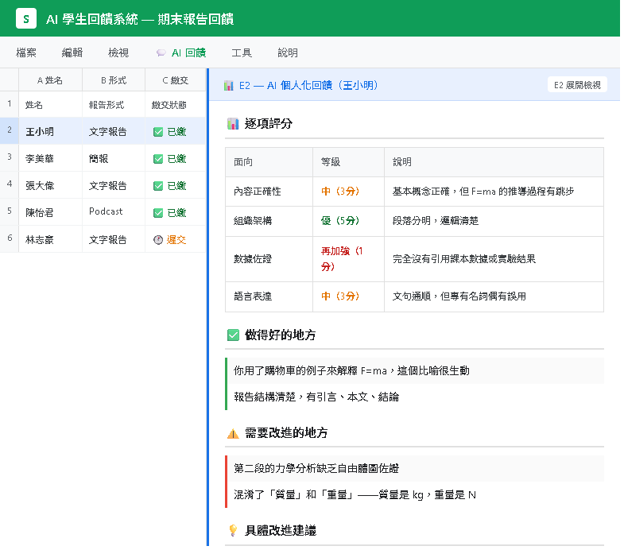

#### Step 3：使用流程

1. 在 A 欄填入學生姓名
2. 在 B 欄填入評量形式（文字報告 / 概念圖 / Podcast）
3. 在 C 欄貼上對應的 Rubric
4. 在 D 欄貼上學生作品內容
5. 選取該列，點選「💬 AI 回饋」→「🔄 產生個人化回饋」
6. 或點選「📧 批次產生全部回饋」一次處理全班

> **📸 圖 4-6：批次回饋完成畫面**
>
> 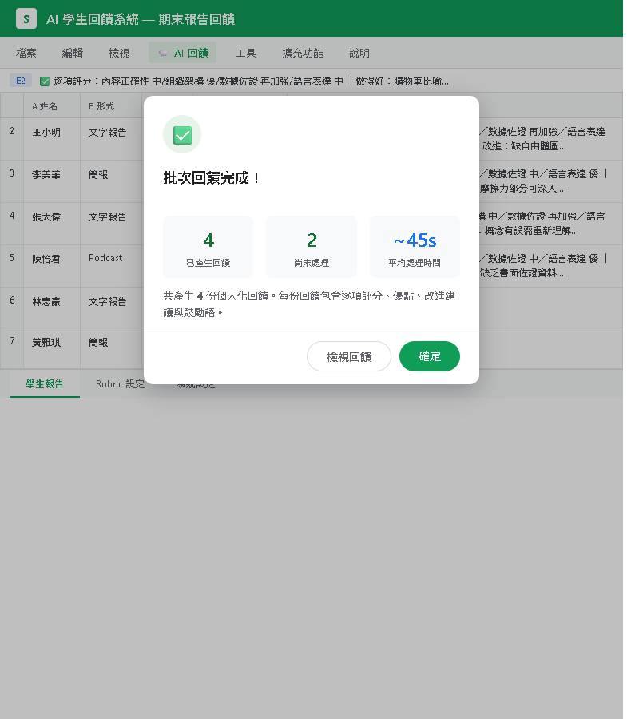

### 回饋品質對照

| | 沒用 Rubric | 有用 Rubric + 正確問法 |
|---|---|---|
| AI 評語 | 「你寫得很好！」 | 「第二面向『數據佐證』你得到『中（3分）』，因為...」 |
| 優點描述 | 「結構清晰」（空泛） | 「你用了力矩平衡的概念來分析天平，這個思路正確」 |
| 缺點指出 | 幾乎不指出 | 「自由體圖只畫了重力，遺漏了正向力和摩擦力」 |
| 改進建議 | 「繼續加油」（沒用） | 「建議先列出物體受到的所有力，再畫自由體圖」 |

### 對應「關係」需求

> **關係（Relatedness）**：學生感覺到「有人在乎我的學習」。

每位學生都收到**針對自己作品**的個人化回饋 → 感受到被關注 → 關係需求被滿足。

### 實作練習

> **🎯 任務：用 AI 批改一份學生作品！**
>
> 1. 準備一份 Rubric（可以用剛才 Gemini 產的）
> 2. 準備一份學生作品（或自己模擬寫一份）
> 3. 貼入 Google Sheets 並執行 AI 回饋
> 4. 檢查回饋品質：
>    - AI 有沒有指出缺點？
>    - 回饋是否具體（有引用作品內容）？
>    - 你會不會想調整 Prompt？
>
> **進階挑戰：** 試著修改 Prompt，讓 AI 的評語風格更符合你的教學風格。

---

# 第五節：分享與總結

## 5.1 各組分享實作成果

> 請各組分享你今天實作了哪些工具，以及最有收穫的部分。

**分享參考方向：**
- 你用了哪個工具？效果如何？
- AI 產出的結果需要修改嗎？修改了什麼？
- 你覺得哪個工具最實用？最想帶回去用？
- 有沒有發現什麼 AI 做不好的地方？

## 5.2 回顧：SDT × 差異化教學 × AI 工具

```
┌─────────────────────────────────────────────────────┐
│                                                       │
│            自我決定理論 × AI 工具總整理                  │
│                                                       │
│  ┌─────────┐     ┌─────────┐     ┌─────────┐        │
│  │ 勝任感   │     │ 自主性   │     │  關係    │        │
│  │         │     │         │     │         │        │
│  │ 工具①   │     │ 多元評量 │     │ 工具③   │        │
│  │ 段考審題 │     │ Rubric  │     │ AI回饋   │        │
│  │         │     │ + 選擇   │     │         │        │
│  │ 教材差異 │     │  策略    │     │ 個人化   │        │
│  │ 化改簡報 │     │         │     │ 回饋     │        │
│  │         │     │         │     │         │        │
│  │ 工具②   │     │         │     │         │        │
│  │ 動態評量 │     │         │     │         │        │
│  └─────────┘     └─────────┘     └─────────┘        │
│                                                       │
│  「我做得到」     「我可以選」      「有人在乎」          │
│                                                       │
└─────────────────────────────────────────────────────┘
```

## 5.3 使用注意事項

### AI 不能取代的事

| AI 可以做 | AI 不能取代 |
|----------|-----------|
| 產出雙向細目表 | 老師對學生程度的判斷 |
| 調整教材難度 | 老師對學生的了解和關懷 |
| 產生提示和題目 | 課堂上的互動和應變 |
| 批量產生回饋 | 面對面的鼓勵和指導 |

### API 金鑰安全

- ⚠️ 不要將 API 金鑰貼在公開文件中
- ⚠️ 不要分享含有 API 金鑰的試算表
- ✅ 使用 Apps Script 的「指令碼屬性」存放金鑰
- ✅ 定期檢查 API 用量（Google AI Studio → API Keys）

### 成本估算

| 模型 | 費用 | 一個班的用量估計 |
|------|------|---------------|
| Gemini 2.5 Flash | 免費額度充足 | 段考審題 + 動態評量 + 回饋 ≈ 免費額度內 |

> 💡 Gemini 2.5 Flash 的免費額度相當充裕，一般教學使用不太會超過。

## 5.4 延伸資源

| 資源 | 連結 | 說明 |
|------|------|------|
| Google AI Studio | https://aistudio.google.com/ | 取得 API Key、測試 Prompt |
| NotebookLM | https://notebooklm.google.com/ | 建立課程知識庫 |
| Google Apps Script | https://script.google.com/ | GAS 編輯器 |
| 國教署段考題庫 | https://www.k12ea.gov.tw/ | 下載段考題練習用 |
| Gemini | https://gemini.google.com/ | 直接與 AI 對話、改簡報 |

---

## 附錄 A：三個工具的快速安裝指南

> **程式碼都在 `GAS程式碼/` 資料夾裡。** 打開對應的 `.js` 檔案，全選複製，貼進 Apps Script 就好。
> 每個 `.js` 檔案的最上面也有完整安裝說明，可以直接照著做。

### 工具 ① 段考 AI 審題助手

> 程式碼檔案：`GAS程式碼/工具1_段考AI審題助手.js`

```
1. 新增 Google Sheets，命名為「段考AI審題助手」
2. 點「擴充功能」→「Apps Script」
3. 左邊齒輪「專案設定」→「指令碼屬性」→ 新增 GEMINI_API_KEY
4. 回到編輯器 → 全選刪除舊的 → 貼上 工具1 的程式碼 → Ctrl+S 儲存
5. 上方「執行 ▶」→ 函式選 onOpen → 點「執行」→ 完成授權
6. 回到 Sheets → 按 F5 重新整理 → 上方出現「🤖 AI 審題助手」選單
7. A 欄貼上考題 → 點「📊 分析段考試題」→ 等 30 秒搞定
```

### 工具 ② 動態評量產生器

> 程式碼檔案：`GAS程式碼/工具2_動態評量產生器.js`

```
1. 新增 Google Sheets，命名為「動態評量產生器」
2. 點「擴充功能」→「Apps Script」
3. 左邊齒輪「專案設定」→「指令碼屬性」→ 新增 GEMINI_API_KEY
4. 回到編輯器 → 全選刪除舊的 → 貼上 工具2 的程式碼 → Ctrl+S 儲存
5. 上方「執行 ▶」→ 函式選 onOpen → 點「執行」→ 完成授權
6. 回到 Sheets → 按 F5 重新整理 → 上方出現「🎯 動態評量」選單
7. A/B/C 欄填入科目、單元、知識點 → 點「📝 產生動態評量題目」
8. 檢查題目和提示 OK 後 → 點「📋 建立 Google Form」
```

### 工具 ③ AI 學生回饋系統

> 程式碼檔案：`GAS程式碼/工具3_AI學生回饋系統.js`
> 搭配指引：`指引/NotebookLM設定指引.md`

```
1.（選做）先設定 NotebookLM 知識庫（見「指引/NotebookLM設定指引.md」）
2. 新增 Google Sheets，命名為「AI 學生回饋系統」
3. 點「擴充功能」→「Apps Script」
4. 左邊齒輪「專案設定」→「指令碼屬性」→ 新增 GEMINI_API_KEY
5. 回到編輯器 → 全選刪除舊的 → 貼上 工具3 的程式碼 → Ctrl+S 儲存
6. 上方「執行 ▶」→ 函式選 onOpen → 點「執行」→ 完成授權
7. 回到 Sheets → 按 F5 重新整理 → 上方出現「💬 AI 回饋」選單
8. A~D 欄填入姓名、形式、Rubric、學生作品 → 點「🔄 產生個人化回饋」
```

---

## 附錄 B：Prompt 設計速查表

| 情境 | Prompt 技巧 | 範例 |
|------|------------|------|
| 要 AI 分析結構化資料 | 指定 JSON 輸出格式 | 「請用以下 JSON 格式回傳...」 |
| 要 AI 扮演特定角色 | 角色設定 + 專業約束 | 「你是一位嚴謹的高中物理老師」 |
| 要 AI 誠實批評 | 明確要求找缺點 | 「請先指出不足，如果要扣分在哪裡扣？」 |
| 要 AI 依照標準評分 | 提供 Rubric + 逐項要求 | 「根據以下 Rubric 逐項評估」 |
| 要 AI 簡化內容 | 指定目標讀者 + 字數限制 | 「改寫為高一生能懂的版本，每句不超過 20 字」 |
| 要 AI 產出多層次內容 | 明確描述層次差異 | 「提示 1 只給方向，提示 2 給公式，提示 3 帶數字」 |
| 降低 AI 的隨機性 | 設定低 temperature | `temperature: 0.2`（分析用）|
| 增加 AI 的創意 | 設定高 temperature | `temperature: 0.7`（改寫用）|

---

## 附錄 C：常見問題 FAQ

### Q1：API 金鑰要付費嗎？
Gemini 2.5 Flash 有免費額度，一般教學使用綽綽有餘。如果超過免費額度，費用也很低（約每百萬字元 $0.15 美元）。

### Q2：學生資料丟給 AI 安全嗎？
Google Gemini API 的資料政策聲明，透過 API 傳送的資料不會用於訓練模型。但建議：
- 不要傳送學生的身分證字號、地址等敏感個資
- 姓名可用座號代替
- 學校內部使用即可，不要公開試算表

### Q3：AI 產出的雙向細目表準確嗎？
大方向是準確的，但建議老師仍需人工審核。AI 有時會對題目的認知層次判斷不同（例如把「應用」判為「理解」），這正好可以作為反思出題的切入點。

### Q4：動態評量可以用在哪些科目？
所有需要計算或有明確解題步驟的科目都很適合（數學、物理、化學）。文科也可以用，只是提示的設計方式不同（例如提示關鍵詞、提示段落結構等）。

### Q5：我不會寫程式，可以用嗎？
可以！本研習的程式碼都是「複製貼上」即可使用。你只需要：
1. 會用 Google Sheets
2. 會開啟 Apps Script（就是點一個選單）
3. 會複製貼上
4. 會申請 API 金鑰（有步驟教你）

---

## 附錄 D：NotebookLM 設定完整指引

> 搭配「工具 ③ AI 學生回饋系統」使用，讓 AI 的回饋更準確。

### NotebookLM 是什麼？

Google 做的 AI 筆記工具。你上傳自己的教學資料（課本、講義、答案），
AI 會**只根據你的資料**來回答——不會瞎掰、不會亂加東西。

白話說：**幫你的課程建一個專屬 AI 知識庫。**

### 為什麼需要它？

| 沒用 NotebookLM | 有用 NotebookLM |
|-----------------|----------------|
| AI 根據「一般知識」回饋 | AI 根據「你的課程內容」回饋 |
| 可能提到你沒教的東西 | 只參考你上傳的資料 |
| 評分標準模糊 | 對照你的 Rubric 和標準答案 |

### 設定步驟

**Step 1：開啟 NotebookLM**

1. 打開瀏覽器，前往 **https://notebooklm.google.com/**
2. 用你的 Google 帳號登入
3. 點選「**新增筆記本**」（或 + 號）

**Step 2：上傳你的課程資料**

點「**新增來源**」，可以上傳這些東西：

| 上傳什麼 | 為什麼需要 | 格式 |
|---------|----------|------|
| 課本該章節 | 讓 AI 知道學生該學什麼 | PDF |
| 你的講義或簡報 | 讓 AI 知道你教了什麼 | PDF / Google 文件 |
| Rubric 評分規準 | 讓 AI 知道評分標準 | Google 文件 / 純文字 |
| 標準答案或範例作品 | 讓 AI 知道「好」長什麼樣 | PDF / Google 文件 |

> 建議至少上傳 **Rubric + 一份標準答案**，這樣 AI 的回饋品質會大幅提升。

**Step 3：測試知識庫**

上傳完成後，在對話框試問：

```
測試問題 1：「這個單元的核心概念是什麼？學生應該學會什麼？」
測試問題 2：「根據 Rubric，一份『優』等級的作品應該具備什麼特徵？」
測試問題 3：「如果學生寫出 OOO，你會給什麼等級？為什麼？」
```

**確認 AI 的回答有引用你上傳的資料**（回答旁邊會標註引用來源），這表示知識庫設定成功了。

**Step 4：整理重點摘要**

把 NotebookLM 回答的核心概念摘要記下來，之後可以加進「AI 學生回饋系統」的 Rubric 欄位裡，讓回饋更精準。

### 進階用法：產生 Podcast 摘要

NotebookLM 可以把你的課程資料轉成 **AI Podcast**（兩個 AI 主持人用對話方式介紹你的課程內容）。

1. 上傳完資料後，點選右上角的「**Audio Overview**」（音訊概覽）
2. 點「**Generate**」（產生）
3. 等幾分鐘，就會產生一段 5～10 分鐘的 Podcast

**教學應用：**
- 當作學生的預習材料（「上課前先聽這段 Podcast」）
- 當作複習工具（「考前聽一遍重點整理」）
- 讓學生體驗「AI 也可以當老師」

### NotebookLM 常見問題

| 問題 | 回答 |
|------|------|
| 上傳的資料會被拿去訓練 AI 嗎？ | 不會。Google 官方聲明 NotebookLM 的資料不用於訓練。 |
| 可以上傳多少資料？ | 每個筆記本最多 50 個來源，每個來源最大 500,000 字。 |
| 一定要用 NotebookLM 嗎？ | 不一定。工具 ③ 不用也能運作，但有了它回饋品質更好。 |
| 要付費嗎？ | 免費。只需要 Google 帳號。 |

---

## 關於作者

**曾慶良 主任（阿亮老師）**

**現任職務：** 新興科技推廣中心主任 ／ 教育部學科中心研究教師

**獲獎紀錄：**

| 年份 | 獎項 |
|------|------|
| 2025 | SETEAM教學專業講師認證 |
| 2024 | 教育部人工智慧講師認證 |
| 2022-2023 | 指導學生XR專題競賽特優 |
| 2022 | VR教材開發教師組特優 |
| 2019 | 百大資訊人才獎 |
| 2018-2019 | 親子天下創新100教師 |
| 2018 | 臺北市特殊優良教師 |
| 2017 | 教育部行動學習優等 |

**聯絡方式：** YouTube：https://www.youtube.com/@Liang-yt02 ｜ Facebook 社團：https://www.facebook.com/groups/2754139931432955 ｜ Email：3a01chatgpt@gmail.com

---

## 授權聲明

**© 2026 阿亮老師 版權所有**

本教材僅供「阿亮老師課程學員」學習使用。

- 禁止修改本教材內容
- 禁止轉傳或散布
- 禁止商業使用
- 禁止未經授權之任何形式使用

如有任何授權需求，請聯繫作者。

---

> 📝 **研習教材製作**：AI 工具協助差異化教學
> 🏫 **適用對象**：高中教師（數位前導計畫）
> 👨‍🏫 **作者**：曾慶良 主任（阿亮老師）
